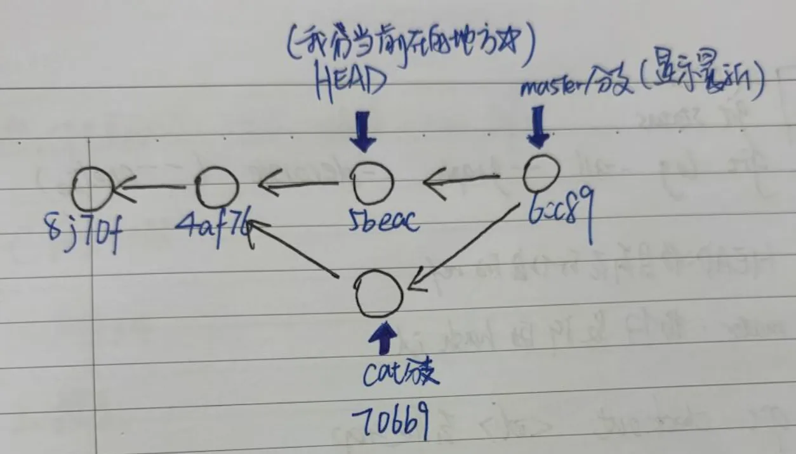

## Git

### 一、Git数据模型

#### 1、分支模型

#### 2、核心思想：所有的 git 都是基于 object data 和 reference data 两个东西

(1) object 就是整个项目全部信息的真实存储
- 所有的 objects 汇聚成一个 node，也就是汇聚成一个 snapshot 节点
- 在这个 node 下，每一个 object 是文件夹，文件，提交信息的一种
<pre lang="c">
type object = blob | tree | commit

// 文件就是一组数据
type blob = array<byte>

// 一个包含文件和目录的目录
type tree = map<string, tree | blob>

// 每个提交都包含一个父辈，元数据和顶层树
type commit = struct {
    parents: array<commit>
    author: string
    message: string
    snapshot: tree
}
</pre>

- objects 一旦提交，将只读，意味着整个分支模型只能往前，不能往后
<pre lang="c">
// 1.所有的 object 汇聚成一个 objects 的 snapshot，并用 hash 存储每一个 object 的信息
objects = map<string, object>

def store(object):
    id = sha1(object)
    objects[id] = object

def load(id):
    return objects[id]

// 2.snapshot 本身也是用 hash值标记的
references = map<string, string> 
// key 为"master"或者"HEAD"这样的名称
// value 为 sha1 的 hashcode 如 4af32...7f

def update_reference(name, id):
    references[name] = id

def read_reference(name):
    return references[name]

def load_reference(name_or_id):
    if name_or_id in references:
        return load(references[name_or_id])
    else:
        return load(name_or_id)
</pre>

(2) reference 就是建立一种映射关系，更好的去获取每个节点的 snapshot
- 比如 HEAD 就是一个 ref，master 也是一个 ref
- HEAD 指向我们目前想指向的object 的 snapshot（可以是旧的）
- master 指向当前 master 分支最新的 snapshot，不同分支别名永远指向最新的 snapshot（其他分支名同理）
- 但是远程仓库是可能领先我们本地的最新分支的
- HEAD落后不会影响合并，依旧会把 feature 合并到 master 最新的节点（snapshot 只能往前）

(3) git 所有的节点（object）都是一个只读的 snapshot，所以保存好提交后就不能再修改，只能用 reference 去引用。它只能往前，不能往后，也不能修改

### 3、代码合并与变基
(4) merge 是把别的分支合到我们当前的分支
- 比如我们想把 feature 合并到 master 上，我们要先 checkout 到 master，再用 merge 把 feature 合进来
- rebase变基的意思是把变动的提交和 merge 合成同一个节点，有效的剪枝

### 4、远程仓库

二、Git 常用命令

0、git help 命令

1、 git init

2、git remote 
- git remote
- git remote add origin git@github.com:roadlmy/cs_notebook.git

3、git status
4、git log --all --graph --decorate (--oneline)
5、git diff
- git diff <filename>: 显示与暂存区文件的差异
- git diff <revision> <filename>: 显示某个文件两个版本之间的差异

6、git checkout 
- git checkout \<branchname\> 如果已有分支名，去这个分支的最新 snapshot；否则在 HEAD 处创建新的分支名
- git checkout -b \<branchname\> 全部

7、git branch 

8、git merge \<branchname\>

